从前有一个原始人，他养了几头羊🐑，他希望天天都可以在自己的家，明确的知道羊的数量。

于是他找来1个碟子，又去海边捡了许多一样大小的石子。他试着放了一下，一个碟子里恰巧可以放9个石子。
他现在有8只羊。所以他的碟子是这样的：

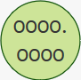

后来他多了一头羊，一共9头，他的盘子变这样：

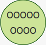

后来他又多了一头羊，变成了10头。盘子只能放下9个石子，多一个放不下了。于是他想了一极其聪明的办法，再放一个盘子，然后在这个盘子里每放一个石子，就代表有10头羊。为了让家人也一眼就能看出来，他们家现在有多少头羊，他在盘子下边写上“X 10”，于是家人都清楚的知道，这个盘子里，每放一个石头，就代表有10头羊，而不是1头。他在原先那个盘子下边写上“X 1”， 就代表每放一个石子，就只有一头羊，这样家人只要看到盘子，就知道他们家有几头羊了。所以他家羊的数量是这样的：

$$ 1 \times \underline{10} + 0 \times \underline1 = 100 $$

慢慢的，他的羊多了起来。当某天，盘子里是这样的时候，家人一眼就可以看出来，他们现在有56头羊：

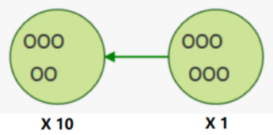

后来他羊的数量越来越多，达到了99只。两个盘子都放满了9个石子：

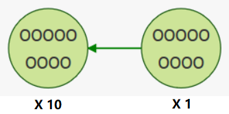

终于某天，羊的数量突破了99，达到100只。于是他找来第3个盘子，他的石子是这样的：

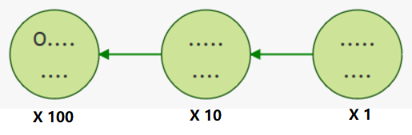

依次类推，每个盘子中放**一个**石子，所代表的数量为：

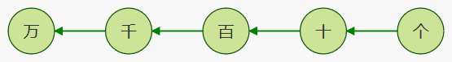

这就是十进制。大家再熟悉不过了。

如果最初这个原始人捡到的石子比较大，一个碟子里最多只能放7个，那么情况会如何呢？
当他有8只羊的时候，他就得利用2个盘子了：

7只羊：
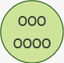

八只羊：
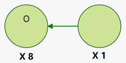
$$1 \times \underline8 + 0 \times \underline1 = 8$$

直到2个盘子都用完了：
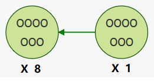
$$7 \times \underline8 + 7 \times \underline1 = 63$$

再加1，只能用第3个盘子了。

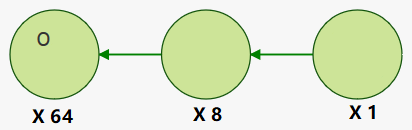
$$1 \times \underline{64} + 0 \times \underline8 + 0 \times \underline1= 64$$

**10**进制，一个盘子只能装**9**个，第二个盘子代表**10**，第三个盘子代表 **100** $(10\times10, 10^2)$

**8**进制，一个盘子只能装**7**个，第二个盘子代表**8**，第三个盘子代表 **64** $(8\times 8, 8^2)$

所以，每放一个石子，代表的数量为：

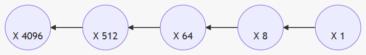

> 2进制叫 Binary，简写Bin。 
> 8进制叫 Octal，简写Oct。古罗马October是8月，后来变为10月。 
> 10进制叫 Decimal，简写Dec。古罗马December是10月，后来变为12月。 
> 16进制叫 Hexadecimal，hexa是六，dec是十。

---
10进制转8进制，其实就是数完羊，往碟子里放石子的过程：

不停的去比较，看哪个盘子里可以放多少个石子。比如我有2200头羊，那么首先，4096盘子里不会有石头，然后看512盘子，里面最多可以放 4个石头，还剩$2200-512\times4=152$头羊。

$$ 4 \times \underline{512} = 2048 $$

还剩下152头羊没有统计。只能往其他盘子里放石子了。64倍的盘子里，还可以放2个石子。还剩$152-2\times64=24$头没有统计。

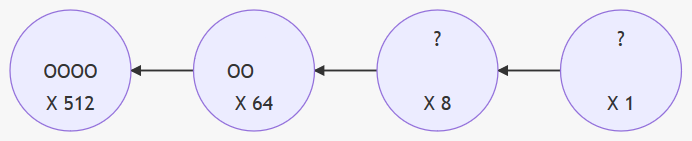

$$  4 \times \underline{512} + 2 \times \underline{64} = 2176 $$
最后24头正好在8的盘子里放3个石子。

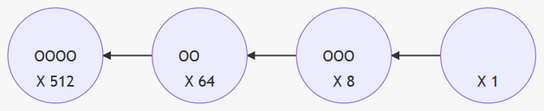
$$  4 \times \underline{512} + 2 \times \underline{64} + 3 \times \underline{8}= 2200 $$

所以 2200 Dec = 4230 Oct
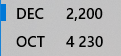